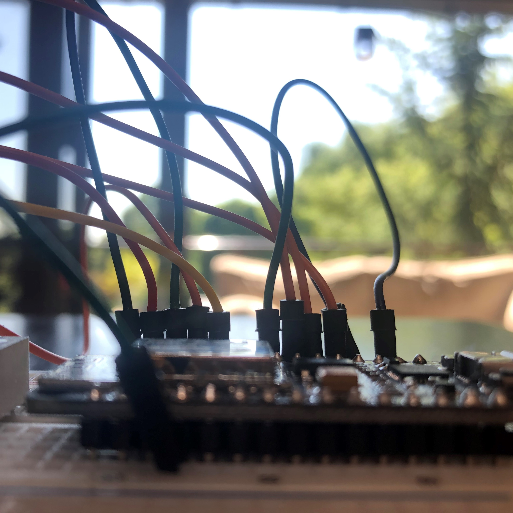

# ESP_Messenger



This project was born out of the increase in technology, yet decrease in human interaction caused by the COVID-19 pandemic. Texts and emails just didn't feel as personal, and some issues with the United States Mail System motivated me to invent my own form of messenging. Based around a PHP script implemented on my personal website, this program also uses an encryption program I wrote (It is not secure, it was just merely to make me feel like a capable hacker)


## How To Use
While this project was mainly for personal use, I figured maybe some of the code could be of some use.

### Download
Download repository using method of choice. Place everything into a folder called 
```
function test() {
  console.log("notice the blank line before this function?");
}
```
